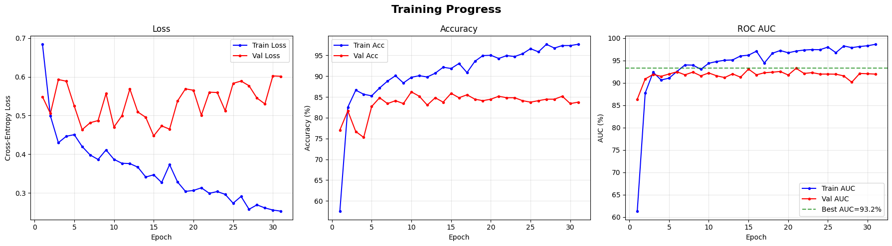
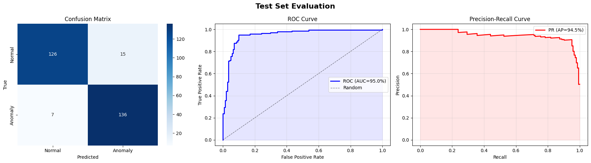
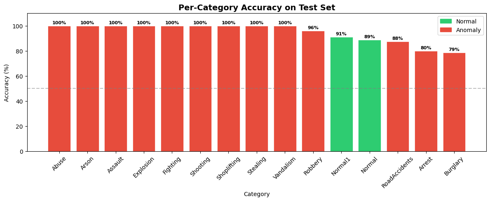
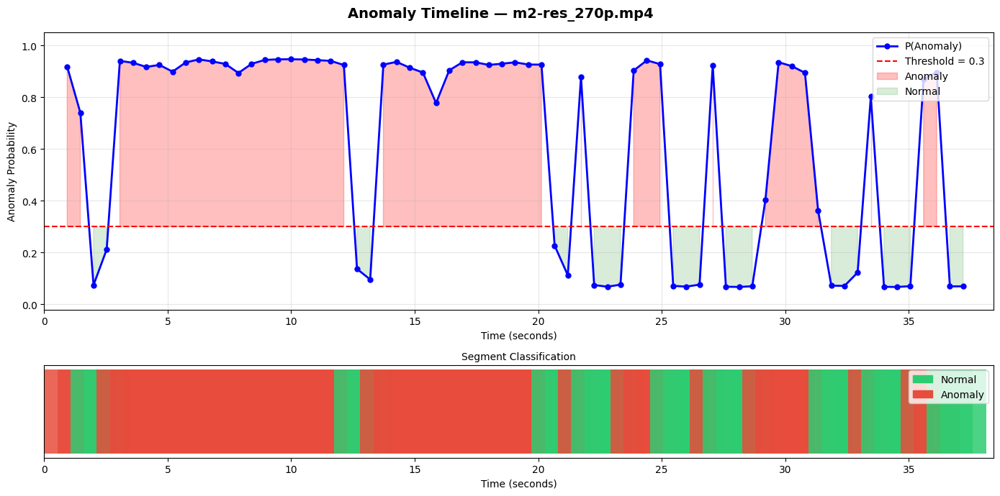
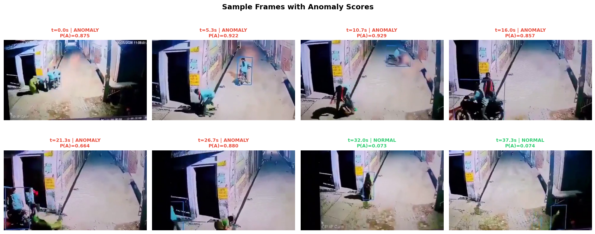
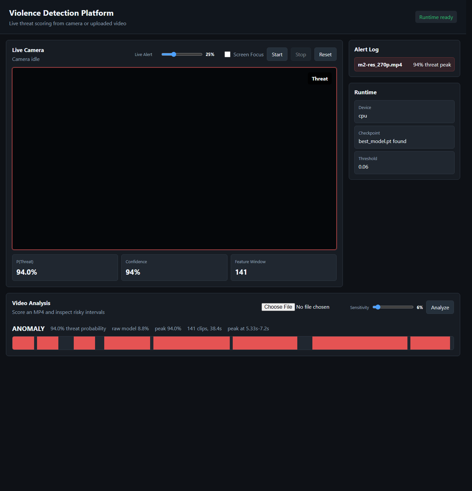

# Web Version : https://huggingface.co/spaces/Kartikeym2007/Anomaly_Detection_Vision_Transformer-AVT  || Note Since its hosted on  Hugging Face , you can just see the layout and run model on ( cpu / hugging face free tier cpus )- So it will be slow!!

# Violence Detection Platform

A Flask-based violence/anomaly detection platform using a trained VideoMAE feature
extractor plus the project `AnomalyTransformer` checkpoint.

## Project Layout

```text
vad_project/
  app.py                         # Root entrypoint: python app.py
  requirements.txt               # Python dependencies
  src/
    vad_platform/                # Runtime package
      config.py                  # Thresholds, model paths, runtime config
      detector.py                # Live/video inference service
      model.py                   # AnomalyTransformer architecture
  web/
    templates/index.html         # Browser dashboard
    static/app.js                # Camera, upload, API UI logic
    static/styles.css            # Dashboard styles
  scripts/
    preprocessing/               # Feature checks and consolidation
    training/                    # SRU/SRU++ training scripts
  artifacts/
    checkpoints/best_model.pt    # Deployed trained checkpoint
    features/                    # Consolidated embeddings/labels
    models/                      # SRU/SRU++ training outputs
    reports/                     # Charts, timelines, evaluation outputs
    logs/                        # Training/runtime logs
  data/
    UCF-Crime_dataset/           # UCF-Crime feature dataset
    samples/                     # Test/sample MP4 files
  notebooks/                     # Original training/inference notebooks
```

## Run

```bash
pip install -r requirements.txt
python app.py
```

Open:

```text
http://127.0.0.1:5000
```

The app loads:

```text
artifacts/checkpoints/best_model.pt
```

If CUDA PyTorch is installed, the backend uses the NVIDIA GPU automatically.

The original notebook was run with PyTorch `2.5.1`. This app is compatible with
PyTorch `2.5.1+` and explicitly handles the PyTorch `2.6+` checkpoint loading
change. Inference uses FP32 by default to keep scores closer to the notebook.

## Dependency Checks

Runtime dependencies:

```bash
pip install -r requirements.txt
python -m unittest discover -s tests -v
```

Optional SRU/SRU++ training dependencies:

```bash
pip install -r requirements-training.txt
```

Optional browser export dependencies:

```bash
pip install -r requirements-export.txt
python scripts/export/export_browser_models.py
```

Browser-side ONNX artifacts are stored under:

```text
web/static/models/browser/
  manifest.json
  videomae_feature_extractor.onnx
  anomaly_transformer.onnx
```

The browser analyzer uses ONNX Runtime Web with WebGPU when available and falls
back to WASM otherwise. The server analyzer remains available as the reliable
fallback for browsers or devices that cannot load the larger client models.

On Windows, SRU requires MSVC Build Tools (`cl`) and a CUDA toolkit for its JIT
kernels. The deployed platform does not need SRU.

## Features

- Live browser camera scoring
- Upload MP4 analysis
- Segment timeline and peak threat score
- Separate live and upload sensitivity controls
- Live alert hysteresis to avoid low-score alert spam
- Optional Screen Focus mode for testing with a video playing on another screen

## Screenshots

The training and MP4 inference notebooks in `notebooks/` were used to produce
the process and result screenshots below.

### Training Process

`notebooks/UCF_Crime_Anomaly_Detection_Training.ipynb` trains the temporal
Transformer on extracted UCF-Crime VideoMAE/ViT features, tracks validation
metrics, and saves the best checkpoint to `artifacts/checkpoints/best_model.pt`.



### Training Results

The same notebook evaluates the best checkpoint with confusion matrix, ROC, PR,
and per-category accuracy reports.





### MP4 Inference Process

`notebooks/Anomaly_Detection_MP4_Inference_VideoMAE.ipynb` loads an MP4, builds
overlapping 16-frame clips, extracts VideoMAE features, and scores the video
with the trained anomaly model.





### Localhost Result View

The Flask dashboard at `http://127.0.0.1:5000/` displays the deployed result
view for an uploaded sample MP4, including the peak threat score and timeline.



## API

| Endpoint | Method | Purpose |
|---|---|---|
| `/api/health` | GET | Runtime, checkpoint, GPU, threshold status |
| `/api/live-frame` | POST | Score one live camera frame in rolling context |
| `/api/analyze-video` | POST | Upload and analyze a video |
| `/api/reset` | POST | Clear live buffers and alert history |

## Training Utilities

Check consolidated feature files:

```bash
python scripts/preprocessing/check_features.py \
  --embeddings artifacts/features/embeddings.npy \
  --labels artifacts/features/labels.npy
```

Consolidate VideoMAE feature folders:

```bash
python scripts/preprocessing/preprocess_videomae_features.py
```

Train SRU:

```bash
python scripts/training/sru_training.py \
  --embeddings_path artifacts/features/embeddings.npy \
  --labels_path artifacts/features/labels.npy \
  --input_size 768 \
  --num_classes 2 \
  --hidden_size 512 \
  --num_layers 2 \
  --epochs 100 \
  --batch_size 16 \
  --learning_rate 0.001 \
  --save_dir artifacts/models
```

Train SRU++:

```bash
python scripts/training/srupp_training.py \
  --embeddings_path artifacts/features/embeddings.npy \
  --labels_path artifacts/features/labels.npy \
  --input_size 768 \
  --num_classes 2 \
  --hidden_size 512 \
  --proj_size 384 \
  --num_layers 2 \
  --epochs 100 \
  --batch_size 16 \
  --learning_rate 0.001 \
  --save_dir artifacts/models
```
